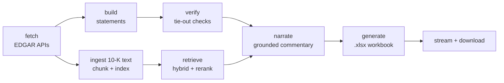

# Architecture

**One line:** type a ticker → a verified three-statement Excel model with cited management commentary. Measured, not estimated: ~70 seconds end-to-end on a cold run with real narration (10 line items narrated sequentially — the largest share of that time), sub-second on a cached repeat request. Concurrent narration (fan out the per-line-item calls instead of looping) is the obvious next latency win, not yet done.

**Design principle:** numbers are computed by deterministic code, words are written by an LLM, and a verifier stands between them and the user. The LLM is never trusted with arithmetic; the pipeline is never allowed to ship an unverified or ungrounded claim.

## Pipeline

An agent graph (LangGraph) orchestrates these steps as tools. Every step emits a `RunEvent` (streamed to the browser via SSE) and a trace span (Langfuse).

## Components

1. **`app/edgar`** — EDGAR client. `companyfacts` JSON for numbers, `submissions` for filing metadata, filing HTML for text. Disk cache under `data/cache/` keyed by URL hash, so every run is reproducible and demos work offline after the first fetch. Respects SEC fair use: declared User-Agent, ≤10 req/s, cache-first, backoff on 429.
2. **`app/model`** — `tags.py` maps ~35 canonical line items to `us-gaap` XBRL tag fallback chains (companies tag the same concept differently). `builder.py` produces a `StatementSet` (income statement, balance sheet, cash flow; last 5 fiscal years). `verifier.py` asserts accounting identities — balance sheet equation, retained-earnings roll-forward, cash roll-forward, statement subtotals — and emits a `TieoutReport`. `excel.py` writes the workbook: three statement tabs, a Ratios tab whose cells are live formulas (`=B12/B4`), a Commentary column with citations, and a Tie-out tab showing every check.
3. **`app/rag`** — `ingest.py` parses the 10-K into sections (Item 7 MD&A, Item 1A Risk Factors) and chunks ~800 tokens with heading context. `index.py`: Chroma for vectors + BM25 for keywords. `retrieve.py`: hybrid search fused with reciprocal rank fusion, then a cross-encoder rerank, then a relevance threshold. `narrate.py`: Claude writes ≤2-sentence commentary per line item, grounded in retrieved chunks, returning the `Commentary` schema; citation quotes must be verbatim substrings of their chunks or the output is rejected. Below-threshold retrieval → no commentary, by design.
4. **`app/agent`** — the LangGraph state machine wiring fetch → build → verify → retrieve → narrate → generate, with per-node error handling and event emission.
5. **`app/api` + `web/`** — FastAPI. `POST /runs {ticker}` starts a run, `GET /runs/{id}/events` streams SSE progress, `GET /runs/{id}/model.xlsx` serves the file. One static HTML page (Tailwind CDN), no build step: the demo *is* the live step stream.
6. **`app/obs`** — Langfuse tracing (no-op when keys are absent) and a SQLite run log: durations, token spend, tie-out outcomes.
7. **`evals/`** — first-class, versioned next to the code: tie-out accuracy (generated cells vs filed values — binary), retrieval precision/recall@k on a hand-labeled query set, and an LLM-as-judge rubric for commentary (grounded? cited? zero invented numbers?), scored by a different model than the generator. Output: `evals/scorecard.json`, rendered in the README. Never run in CI.

## Key decisions & trade-offs
- **XBRL API over PDF parsing** — clean structured numbers for free; the trade-off is tag-mapping work (`tags.py`) and best-effort coverage outside large caps. Accepted: 5–10 pre-verified tickers guaranteed, the rest best-effort.
- **LangGraph over plain SDK calls** — the pipeline is nearly linear, so this is marginally more ceremony; chosen because agent orchestration is an explicit goal of the project and the postings it targets.
- **Local embeddings (sentence-transformers) + Chroma over hosted vector DB** — zero cost, zero infra, reproducible. Trade-off: heavier container; fallback documented in `docs/SESSIONS.md` (Chroma's built-in ONNX embedder).
- **Haiku for cheap structured calls, Sonnet for narrative** — target <$0.15 per uncached run.
- **Fail-closed defaults everywhere** — worse demo ergonomics on obscure tickers, but "flagged, never smoothed over" is the product's entire claim.

## Failure modes handled
Missing XBRL tags (fallback chain, else blank + flag) · non-calendar fiscal years · restated values (use latest filed, note it) · weak retrieval (refuse commentary) · LLM schema violations (one retry, then fail closed) · SEC rate limiting (cache + backoff) · arithmetic that doesn't tie (surfaced in the Tie-out tab and the UI).
