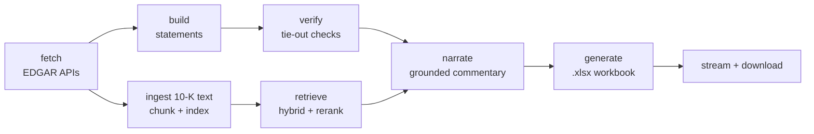

# tieout

SEC filing in, verified Excel financial model out: deterministic code computes every number, an LLM only explains what the code produced, and a verifier stands between the two of them and you.

## 60-second demo

1. Open the single-page UI and type a ticker, e.g. `AAPL`.
2. The page POSTs to `POST /runs {"ticker": "AAPL"}`, gets back a run id, and opens `GET /runs/{id}/events` — an SSE stream that pushes each pipeline step live: `fetch → build → verify → retrieve → narrate → generate`.
3. When the stream reaches `generate`, a **Download model.xlsx** button appears, backed by `GET /runs/{run_id}/model.xlsx`.
4. Open the workbook: three statement tabs, a Ratios tab of live formulas (`=B12/B4`, not hardcoded values), a Commentary column with citations back to the filing, and a Tie-out tab showing every accounting-identity check pass/fail.

<!-- demo GIF goes here: a ~60s recording of the flow above is planned (see docs/SESSIONS.md) but not yet recorded -->

**Measured latency** (live run, `AAPL`, real narration, not a mock): **71 seconds** end-to-end on a cold run, 6/10 line items grounded with verbatim citations. The identical second request hits the workbook cache (keyed by ticker + filing) and returns in **0.07 seconds**.

## Architecture

The pipeline is a small LangGraph state machine: fetch numbers from EDGAR, build and verify the statements deterministically, retrieve and narrate grounded commentary in parallel, then generate the workbook. Every step emits a `RunEvent` (streamed to the browser over SSE) and a trace span. Numbers never pass through the LLM; only pre-formatted strings do.

*(diagram reused from `ARCHITECTURE.md`, the source of truth for design decisions and trade-offs)*

- **`app/edgar`** — cached, rate-limited, host-allowlisted SEC EDGAR client (`companyfacts` for numbers, `submissions` for metadata, filing HTML for text); disk cache under `data/cache/` keyed by URL hash makes every run reproducible and lets demos run offline after the first fetch.
- **`app/model`** — XBRL tag fallback chains for canonical line items, a 5-year `StatementSet` builder, and a verifier that asserts accounting identities and writes the workbook (statement tabs, live-formula Ratios tab, Commentary column, Tie-out tab).
- **`app/rag`** — 10-K section parsing and chunking, hybrid BM25 + vector retrieval with reciprocal rank fusion and cross-encoder reranking, and grounded per-line-item commentary generation that rejects any citation or number not verifiably present in the retrieved text.
- **`app/agent`** — the LangGraph graph wiring fetch → build → verify → retrieve → narrate → generate, with per-node error handling and event emission.
- **`app/api`** (+ `web/`) — FastAPI endpoints (`POST /runs`, `GET /runs/{id}/events` over SSE, `GET /runs/{id}/model.xlsx`) and a single static HTML demo page; no build step.
- **`app/obs`** — structured logging, no-op-by-default Langfuse tracing, and a SQLite run log of durations, token spend, and tie-out outcomes.
- **`evals/`** — versioned datasets and deterministic scoring for tie-out accuracy, retrieval precision/recall@k, and LLM-as-judge commentary quality; produces `evals/scorecard.json`, rendered below. Never run in CI (see Development).

## Scorecard

<!-- SCORECARD:START -->
_Generated at 2026-09-20T20:28:35.784232+00:00 from commit `10603eb`._

### Tie-out accuracy (binary, cell-level, vs. raw companyfacts JSON)

Overall: **430/430** (100.0%), tolerance $1.

| Ticker | Correct | Total | Accuracy |
| --- | --- | --- | --- |
| AAPL | 215 | 215 | 100.0% |
| MSFT | 215 | 215 | 100.0% |

Mismatches: **0**.

### Retrieval precision/recall@k

Backend: **BM25-only**.

**Production query pattern (`retriever.retrieve(item.label)`)** (measures what the app actually issues today):

| P@1 | P@3 | P@5 | P@10 | R@1 | R@3 | R@5 | R@10 |
| --- | --- | --- | --- | --- | --- | --- | --- |
| 33.3% | 33.3% | 28.9% | 17.8% | 13.0% | 46.3% | 70.4% | 83.3% |
(9 scored, 11 without gold, 0 skipped, out of 20 queries)

**Hand-written analyst questions** (measures a broader capability, not what production issues today):

| P@1 | P@3 | P@5 | P@10 | R@1 | R@3 | R@5 | R@10 |
| --- | --- | --- | --- | --- | --- | --- | --- |
| 80.0% | 53.3% | 32.0% | 16.7% | 40.0% | 86.7% | 86.7% | 90.0% |
(15 scored, 0 without gold, 0 skipped, out of 15 queries)

**Fail-closed refusal rate** (irrelevant queries, production `RagSettings()` defaults): **0.0%** (0/5 correctly refused, 0 skipped).

### LLM-as-judge (groundedness, citation presence, invented numbers)

Generator: `claude-sonnet-5`; judge: `claude-opus-5` (deliberately a different model).

| Criterion | Result |
| --- | --- |
| Grounded | 12/12 (100.0%) |
| Cited | 10/12 (83.3%) |
| No invented numbers | 12/12 (100.0%) |

(12/12 narrated items judged; tickers run: AAPL, MSFT)
<!-- SCORECARD:END -->

## Bugs our own reviews caught

Every bug below was caught by our own tests or an adversarial review pass before it shipped — the review process is a feature of this project, not an afterthought. The full session-by-session detail lives in `docs/BUILDLOG.md`.

- **Hardcoded unit bucket silently zeroed two line items.** `FactIndex` hardcoded the `"USD"` unit when selecting facts, which silently dropped `eps_diluted` and `weighted_diluted_shares` — both filed under `USD/shares` and `shares`, not `USD`. Caught by our own tests; fixed by threading a `unit` field through `TagSpec` instead of assuming one unit for every tag.
- **Case-sensitive delimiter bypass.** The prompt-injection defense that neutralizes filing-excerpt delimiters checked for `</FILING_EXCERPT>` case-sensitively, so a differently-cased closing tag in untrusted filing text sailed straight through. Caught by adversarial review; fixed by normalizing case before the match.
- **Substring number-grounding let fabrication through.** The original number-grounding check used plain substring containment, so a fabricated `"1.04"` in generated commentary passed as "grounded" merely because it's a contiguous substring of the real, unrelated figure `"$391.04B"`. Fixed with a boundary-aware match that requires the number to appear as its own complete number in a figure or citation, not as a fragment of a longer one.
- **SSE lost-wakeup race could hang a stream forever.** A race in the SSE notify pattern meant a client could miss the wakeup for the terminal event and hang indefinitely waiting for a stream that had already finished. Caught by a second review pass; fixed with a reproduction test before the fix landed.
- **Unsynchronized cache-write race (this session).** `EdgarClient`'s disk cache wrote response bodies directly to their final path, so two concurrent runs fetching the same URL — or a write that failed partway — could leave a truncated or partially-written cache entry that a later reader would load as if it were complete. Fixed by writing to a temp file in the same directory, `fsync`-ing it, and publishing it with an atomic `os.replace`, so a reader only ever sees the old file or the fully-written new one, never a partial one; a cache write failure now degrades to "not cached" and logs only the entry's hash filename, never the URL or response body.
- **Sign-/direction-blind number grounding (this session).** The number-grounding check in `app/rag/narrate.py` matched a claimed number's digits against the figures and citations but ignored sign — so a claim like "revenue grew to $9.45B" could pass grounding against a figure that was only ever given as `-$9.45B`, and a decline could in principle be narrated as growth without tripping any check. Fixed by tracking the polarity (+/-) each number is written with and requiring it to match the figure's own polarity, plus a new direction-of-change check that flags any clause whose "grew"/"declined"/"unchanged" claim contradicts the year-over-year figures it's demonstrably anchored to — abstaining (never over-rejecting) on negation, hedging, or ambiguous phrasing. An adversarial verification pass on the fix itself then caught a second, more subtle version of the same bug: dropping the "$" from a claim (ordinary phrasing — "generated 9.45B" instead of "generated $9.45B") shifted where the sign check looked and let it slip through in both directions again. Fixed in the same session before it shipped.
- **Real narrated commentary attributed a genuine number to the wrong fiscal year, and a "steadily" claim silently skipped a real interior reversal (found by running the LLM-as-judge eval itself, not a synthetic test).** Grading actual model output surfaced two gaps neither the sign nor the direction check above closed: a correctly-valued FY2026 figure was explicitly narrated as "FY2025" (the number itself was real and grounded — only its year label was wrong), and a claim that operating cash flow "rose steadily" across five years quietly omitted a real, material year-over-year decline between the first two (the endpoint-to-endpoint check alone can't see an interior reversal if the two endpoints it's anchored to still net upward). Fixed with a year-attribution check (a number explicitly or relatively — "the most recent year" — tied to a specific fiscal year must match the year the figures actually report it under) and an interior-monotonicity check (a "steadily"/"consistently" claim is validated against every year in its span, not just its two endpoints), both with regression tests reproducing the exact real-sample inputs that found them. See "Methodology notes" below for how this was investigated.

Two review passes in the same session also caught a run that could get stuck at `status="running"` forever on any unhandled exception, a TOCTOU race letting request bursts exceed the daily run cap, and a workbook cache that existed in code but was never wired up — all documented in `docs/BUILDLOG.md`.

## Methodology notes

**Sample sizes are small — read the fractions, not just the percentages.** The judge grades real narrated commentary over a fixed, small universe (10 line items × 2 tickers, and only the ones that actually retrieve grounding chunks in an Item 1A/Item 7-only corpus narrate at all — 12 of 20 in the current run). At n=12, a single flipped verdict moves a rate by ~8 percentage points; the scorecard above always shows the raw `hits/n_judged` fraction next to every judge percentage for exactly this reason.

**One judge verdict, on inspection, looks like judge error rather than a real bug.** MSFT `operating_income` was flagged `no_invented_numbers: false`, but the judge's own `notes` for that verdict argue the opposite — it walks through both numbers named in the commentary, confirms each is verbatim-real ("both are fine"; "making all numbers traceable"), and never identifies an actual invented number. Independently re-deriving the exact figures the generator saw and running them back through `app/rag/narrate.py`'s own grounding/year-attribution/direction checks finds nothing to reject either. Logged here rather than discarded: with an n this small, a single inconsistent LLM-judge verdict (correct reasoning, contradictory boolean) is a real, expected failure mode of LLM-as-judge itself, not evidence of a narration bug — and the honest thing to do is say so, not quietly drop the sample or hand-wave the number up.

**The other four flagged verdicts were real, and are now fixed.** Two `grounded: false` verdicts (a value narrated under the wrong fiscal year, "steadily" skipping a real interior decline) and two `cited: false` verdicts (the commentary's claims were accurate but omitted a citation) reproduced cleanly outside the judge and are addressed above and in "Failure modes" — the `cited: false` cases are a real, if lower-severity, gap: `narrate_line_item` does not currently require a citation whenever one is available, only when a number needs grounding evidence beyond the figures themselves.

## Failure modes

The product's core claim is "flagged, never smoothed over." Concretely:

- **Missing XBRL tags** — each canonical line item has a fallback chain of alternate tags; if every tag in the chain is absent, the cell renders blank and is flagged rather than guessed.
- **Non-calendar fiscal years** — the statement builder handles filers whose fiscal year end doesn't align to the calendar year instead of assuming a December year-end.
- **Restated values** — uses the latest filed value and notes that a restatement occurred, rather than trying to reconcile filing history.
- **Weak retrieval** — below the relevance threshold, `narrate.py` refuses to produce commentary ("no grounded commentary available") instead of guessing from a weak match. Measured caveat, found by `evals/retrieval_eval.py`: the shipped defaults (`min_fused_score=0.0`, no reranker in BM25-only mode) mean the retrieval step itself always returns its top-`k` candidates rather than truly refusing on a genuinely off-topic query (0/5 irrelevant queries were rejected at retrieval in the current scorecard run) — the real fail-closed backstop for a query with no honest answer in the filing is `narrate.py`'s citation/number-grounding checks and the model's own instructed judgment, not a retrieval-level relevance floor. Tightening the default threshold is a real, actionable follow-up outside this session's scope.
- **LLM schema violations** — one retry with the validation error appended to the prompt; if that also fails, commentary is set to `None` (fail closed) and never fabricated.
- **SEC rate limiting** — a disk cache, a token-bucket rate limiter, and exponential backoff with jitter on 429/5xx keep the client inside SEC's fair-use policy.
- **Arithmetic that doesn't tie** — `verifier.py`'s accounting-identity checks (balance sheet equation, cash roll-forward, statement subtotals) surface any failure in the workbook's Tie-out tab and the UI; a failed tie-out is never silently shipped.

## Security

Public repo, public demo endpoint, untrusted inputs on every side (the ticker string, third-party filing text fed to an LLM, anonymous traffic). The full list of requirements — not suggestions — is in `SECURITY.md`. In summary:

- **Input validation** — tickers are validated against a strict regex after uppercasing before any use; never interpolated into shell commands, paths, or URLs.
- **Host allowlist** — outbound HTTP goes only to `data.sec.gov` and `www.sec.gov`, built from constants and validated parts, never raw user input.
- **Prompt injection defenses** — filing text is delimited and explicitly marked as quoted data, not instructions; the narrating model has no tool access; any numeric claim absent from the deterministic dataset causes commentary to be rejected.
- **Excel formula injection** — every cell value passes through `escape_cell()`, which prefixes values starting with `=`, `+`, `-`, `@`, tab, or CR with `'`.
- **Path safety** — run artifacts live under server-generated UUID directories; filenames are never derived from user input.
- **Secrets handling** — none in the repo; `.env` is gitignored, `.env.example` holds placeholders only, and keys are never logged.
- **Abuse protection** — per-IP rate limiting, a global daily run cap, request size limits and timeouts, and cached workbooks so repeat requests cost nothing.
- **Web hardening** — restricted CORS, `nosniff`/`DENY`/CSP headers, TLS termination, no cookies or PII.
- **Supply chain** — a committed lockfile, `pip-audit` in CI, and a non-root container user.
- **Error handling** — clients get generic errors with a run id; stack traces and config values never leave the server.

## Development

- Setup: `uv sync --all-extras`
- Unit tests (hermetic): `make test`
- Lint: `make lint`
- Types: `make type`
- Dev server: `make run`
- Evals (**local only** — spends real Anthropic API money, never run in CI): `make evals`
